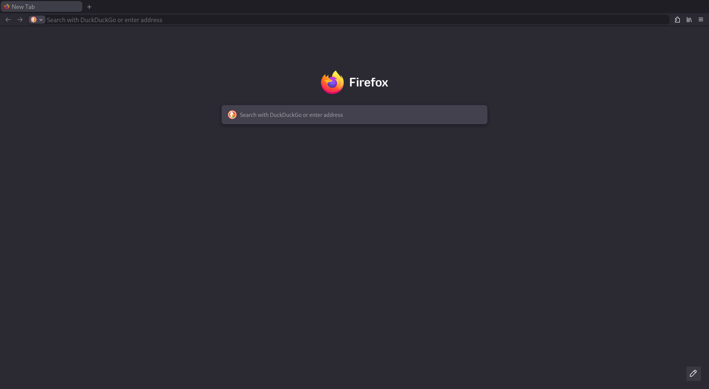

```
20260403 149.0

- release.sh
    -> chrome/userChrome.css
    -> prefs.js
    -> user.js
- extensions/

Upon launch, Google's Widevine CDM and Cisco's OpenH264 plugins
should get installed automatically.

Third-party software is bundled:
- https://github.com/kkapsner/CanvasBlocker/
    - MPL-2.0
    - (third-party-licenses/CanvasBlocker/LICENSE.txt)
- https://github.com/ClearURLs/Addon
    - LGPL-3.0-only
    - (third-party-licenses/ClearURLs/LICENSE)
- https://github.com/gorhill/uBlock
    - GPL-3.0-only
    - (third-party-licenses/uBlock/LICENSE.txt)
```
